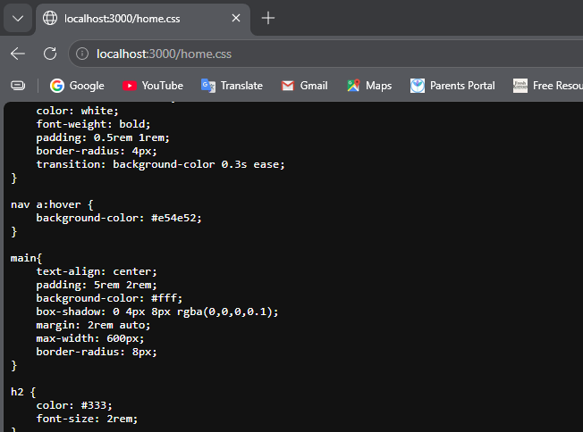

Styling using tailwindcss

11.1 Serving Static Files

Static files are files that the server sends directly to the browser without any processing. Common examples include:

* CSS files
* JavaScript files
* Images
* Fonts

Instead of creating separate routes for these files, Express can serve them automatically using middleware.

A common practice is to create a folder named `public` and store all static assets inside it.

Express provides the express.static() middleware.

```javascript
const express = require('express');

app.use(express.static('public'));
```

This tells Express to look inside the public folder whenever the browser requests a static file.

Suppose the file is stored at:

`public/home.css`

In the HTML file:

`<link rel="stylesheet" href="/home.css">`

Express automatically finds the file inside the public folder and sends it to the browser.




11.2 Introduction to Tailwind CSS

1. Responsive: Mobile-first design for all device sizes.
2. Utility-First: Provides low-level utility classes for building custom designs.
3. Highly Customizable: Easily extendable through a config file.
4. Responsive Design: Built-in responsive utilities (eg., sm:, md:);
5. No predefined components: Focuses on building custom components.
6. Purge CSS: Removes unused styles in production for smaller files.
7. Fast Development: Style elements directly in markup for speed.

11.3 Utility Classes

Instead of writing custom CSS classes, you build designs by applying small utility classes directly in your HTML.

Each utility class usually performs one specific styling task.

Utility classes are pre-defined classes that apply a single CSS property.

Example:

`<p class="text-red-500">Hello</p>`

Equivalent CSS:

`color: #ef4444;`

Here, text-red-500 is a utility class that sets the text color.

11.4 Installing Extensions

Install `tailwindcss intellisense` extension on vscode

11.5 Including Tailwind CSS
11.6 Installing Tailwind CSS
11.7 Using Tailwind CSS