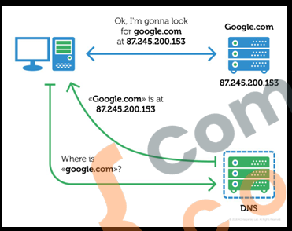
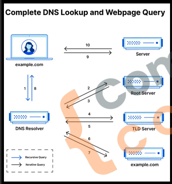
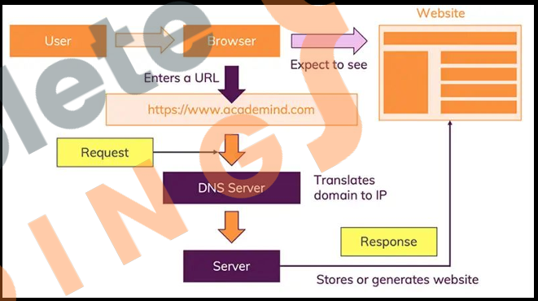

First Node Server

3.1 How DNS wroks?


1. Domain Name Entry: User types a domain (eg., wwww.example.com) into the browser.
2. DNS Query: The browser sends a DNS query to resolve the domain into an IP address.
3. DNS Server: Provides the correct IP address for the domain.
4. Browser Connects: The browser uses the IP to connect to the web server and loads the website.

How DNS actually works?


1. Root DNS: Acts as the starting point for DNS resolution. It directs queries to the correct TLD server (e.g., .com, .org).
2. TLD (Top-Level Domain) DNS: Handles queries for specific top-level domains (e.g., Verisign for .com, PIR for .org)
3. Authoritative DNS: Contains the actual IP address of the domain and answer DNS queries with this information. (e.g., Cloudflare, Google DNS).

3.2 How web works?



1. Client Request Initiation: The client (browser) initiates a network call by entering a URL.
2. DNS Resolution: The browser contacts a DNS server to get the IP address of the domain.
3. TCP Connection: The browser establishes a TCP connection with the server's IP address.
4. HTTP Request: The browser sends an HTTP request to the server.
5. Server Processing: The server processes the request and prepares a response.
6. HTTP Response: The server sends an HTTP response back to the client.
7. Network Transmission: The response travels back to the client over the network.
8. Client Receives Response: The browser receives and interprets the response.
9. Rendering: The browser renders the content of the response and displays it to the user.

3.3 What are protocols?

HTTP (HyperText Transfer Protocol):
* Facilitates communication between a web browser and a server to transfer web pages.
* Sends data in plain text (no encryption).
* Used for basic website browsing without security.

HTTPS (Hyper text transfer protocol secure):
* Secure version of HTTP, encrypts data for secure communication.
* Uses SSL/TLS to encrypt data.
* Usedd in online banking e-commerce.

TCP (Transmission COntrol Protocol):
* Ensures reliable, ordered, and error-checked data delivery over the internet.
* Establishes a connection before data is transfered.

3.4 Node core modules.

1. Built-in: Core modules are included with Node.js installation.
2. No installation Needed: Directly available for use without npm install.
3. Performance: Highly optimized for performance.

1. fs (File System): Handles file operations like reading and writing files.
2. http: Creates HTTP servers and makes HTTP requests.
3. https: Launch a SSL Server.
4. path: Provides utilities for handling and transforming file
5. path.os: Provides operating system-related utility methods and properties.
6. events: Handles events and event-driven programming.
7. crypto: Provides cryptographic functionalities like hashing and encryption.
8. url: Parses and formats URL String.

3.5 Require Keyword

1. Purpose: Imports modules in Node.js
2. Caching: Modules are cached after the first require call
3. .js is added automatically and is not needed to at the end of module name.
4. Path Resolution: Node.js searches for modules in core, node_modules, and file paths.

```javascript
const moduleName = require('module');

// Load the built-in http module
const http = require('http');

// Load the third party express module
const express = require('express');

// Load the coustom myModule module
const myModule = require('./myModule');
```

3.6 Creating first Node Server