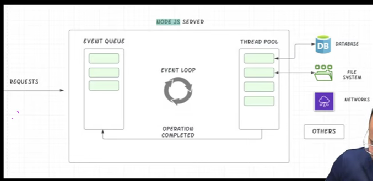
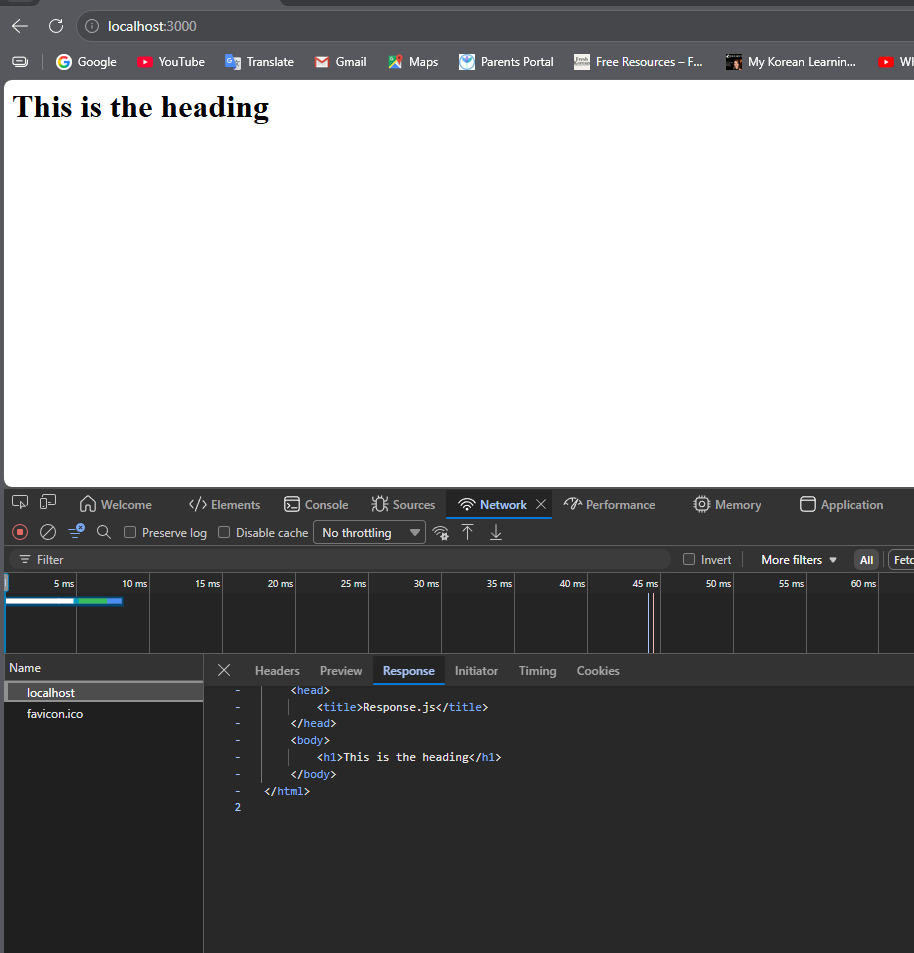
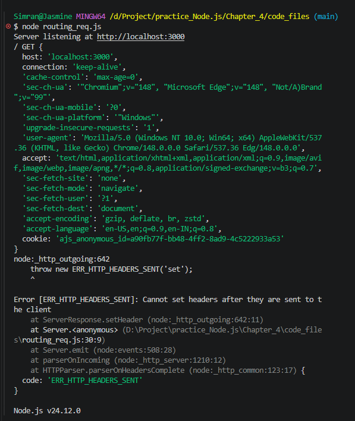
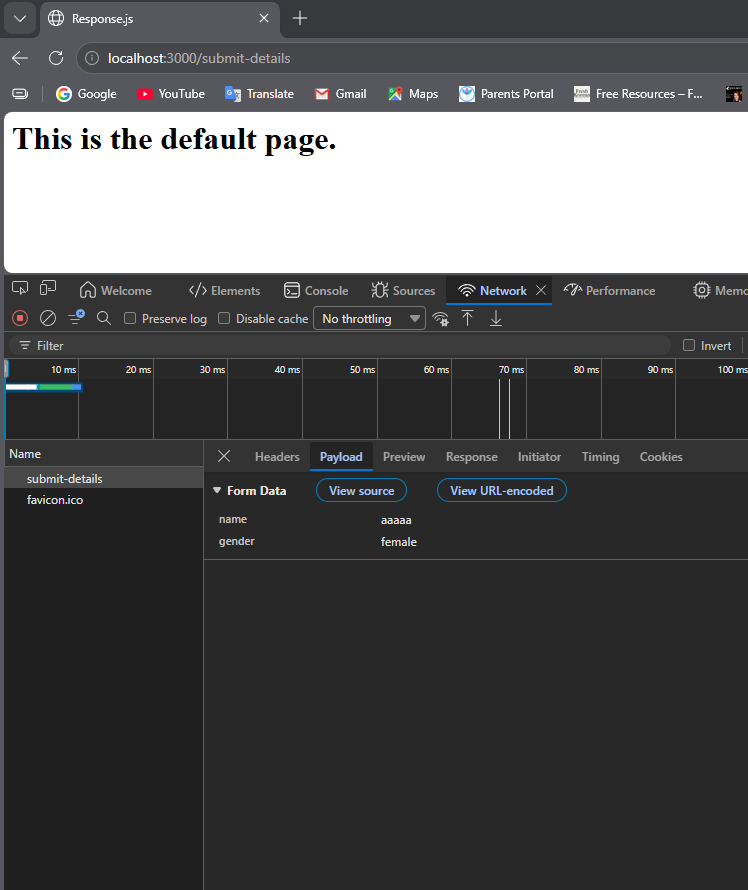
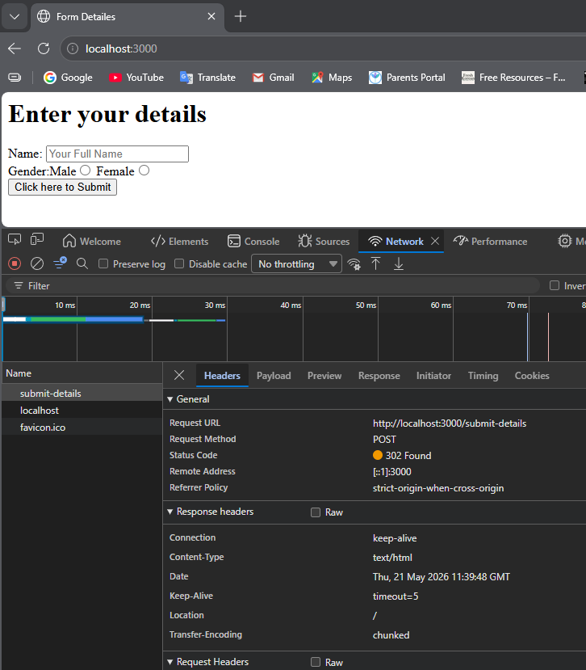

Request & Response

4.1 Node Lifecycle and Event Loop



Node.js is a single-threaded, asynchronous runtime environment. It handles multiple client requests efficiently using the Event Loop and a Thread Pool.

Working / Lifecycle of Node.js
1. A client sends requests to the Node.js server.
2. All incoming requests are placed in the Event Queue.
3. The Event Loop continuously checks this queue.
4. The Event Loop takes one request at a time and processes it.
5. If the task is simple, it is executed directly by the main thread.
6. If the task is time-consuming like:

* File System operations
* Database queries
* Network requests
* Cryptographic operations

then Node.js sends it to the Thread Pool managed by libuv.

7. Worker threads in the thread pool complete the task in the background.
8. After completion, a callback function is returned to the Event Loop.
9. The Event Loop executes the callback and sends the response back to the client.

Event Loop

The Event Loop is the core mechanism that allows Node.js to perform non-blocking I/O operations. It continuously monitors:

* Event Queue
* Callback Queue
* Thread Pool results

It ensures that requests are handled efficiently without creating a new thread for every request.

Advantages
* Fast and scalable
* Handles many concurrent requests
* Efficient memory usage
* Suitable for real-time applications like chats and streaming

Conclusion

Thus, Node.js uses the Event Loop and Thread Pool architecture to handle asynchronous operations efficiently even though it is single-threaded. This makes it highly suitable for modern web applications and APIs.

4.2 How to exit Event Loop

```javascript
const htttp = require('http');

const server = http.createServer((req, res) => {
    console.log(req);
    process.exit(); // Stop event loop

const PORT = 3000;
server.listen(PORT, () =>{
    console.log(`Server running at http://localhost:${PORT}`);
})
})
```

4.3 Understand Request Object

https://developer.mozilla.org/en-US/docs/Web/HTTP/Reference/Headers

```javascript
url: '/',
method: 'GET',
httpVersion: '1.1',
```


```javascript
Symbol(kHeaders): {
  host: 'localhost:3000',
  connection: 'keep-alive',
  'user-agent': 'Mozilla/5.0 ...',
  accept: 'text/html...',
}
```

| Header          | Meaning                               |
| --------------- | ------------------------------------- |
| host            | Which server user requested           |
| user-agent      | Browser details                       |
| accept-language | Preferred language                    |
| cookie          | Stored cookies                        |
| accept          | What response formats browser accepts |

```javascript
const http = require('http');

const server = http.createServer((req,res) =>{
    console.log(req.url, req.method, req.headers);
})

const PORT = 3000;
server.listen(PORT, ()=>{
    console.log(`Server listening at http://localhost:${PORT}`);
})
```


4.4 Sending Response

```javascript
const http = require('http')

const server = http.createServer((req, res) => {
    // res.setHeader('Content-type', 'json');
    res.setHeader('Content-type', 'text/html');
    res.write('<html>');
    res.write('<head>');
    res.write('<title> Response.js</title>')
    res.write('</head>');
    res.write('<body>');
    res.write('<h1>This is the heading</h1>');
    res.write('</body>');
    res.write('</html>');
    res.end();
})

const PORT = 3000;
server.listen(PORT, ()=>{
    console.log(`Server listening at http://localhost:${PORT}`);
})
```



4.5 Routing Requests

```javascript
const http = require('http');

const server = http.createServer((req, res) => {
    console.log(req.url, req.method, req.headers);

    if (req.url === '/'){
        res.setHeader('Content-type', 'text/html');
        res.write('<html>');
        res.write('<head>');
        res.write('<title> Response.js</title>')
        res.write('</head>');
        res.write('<body>');
        res.write('<h1>This is the HOME page.</h1>');
        res.write('</body>');
        res.write('</html>');
        res.end();
    }
    else if(req.url === '/products'){
        res.setHeader('Content-type', 'text/html');
        res.write('<html>');
        res.write('<head>');
        res.write('<title> Response.js</title>')
        res.write('</head>');
        res.write('<body>');
        res.write('<h1>This is the PRODUCTS page.</h1>');
        res.write('</body>');
        res.write('</html>');
        res.end();
    }
    res.setHeader('Content-type', 'text/html');
    res.write('<html>');
    res.write('<head>');
    res.write('<title> Response.js</title>')
    res.write('</head>');
    res.write('<body>');
    res.write('<h1>This is the default page.</h1>');
    res.write('</body>');
    res.write('</html>');
    res.end();

});

const PORT = 3000;

server.listen(PORT, () => {
    console.log(`Server listening at http://localhost:${PORT}`);
});
```


```javascript
const http = require('http');

const server = http.createServer((req, res) => {
    console.log(req.url, req.method, req.headers);

    if (req.url === '/'){
        res.setHeader('Content-type', 'text/html');
        res.write('<html>');
        res.write('<head>');
        res.write('<title> Response.js</title>')
        res.write('</head>');
        res.write('<body>');
        res.write('<h1>This is the HOME page.</h1>');
        res.write('</body>');
        res.write('</html>');
        return res.end();
    }
    else if(req.url === '/products'){
        res.setHeader('Content-type', 'text/html');
        res.write('<html>');
        res.write('<head>');
        res.write('<title> Response.js</title>')
        res.write('</head>');
        res.write('<body>');
        res.write('<h1>This is the PRODUCTS page.</h1>');
        res.write('</body>');
        res.write('</html>');
        return res.end();
    }
    res.setHeader('Content-type', 'text/html');
    res.write('<html>');
    res.write('<head>');
    res.write('<title> Response.js</title>')
    res.write('</head>');
    res.write('<body>');
    res.write('<h1>This is the default page.</h1>');
    res.write('</body>');
    res.write('</html>');
    return res.end();

});

const PORT = 3000;

server.listen(PORT, () => {
    console.log(`Server listening at http://localhost:${PORT}`);
});
```

4.6 Taking User Input
```javascript
const http = require('http');

const server = http.createServer((req, res) =>{
    console.log(req.url, req.method, req.headers);
    if (req.url === "/"){
        res.setHeader('Content-type', 'text/html');
        res.write('<html lang="en">');
        res.write('<head>');
        res.write('<title>Form Detailes</title>');
        res.write('</head>');
        res.write('<body>');
        res.write('<h1>Enter your details</h1>');
        res.write('<form action="/submit-details" method="POST">');        
```
1. if action not given, the url after submitting 
goes to http://localhost:3000/?name=nameis&gender=female
2. If action given but method not given, the url after submitting
goes to http://localhost:3000/submit-details?name=manddel&gender=male

```javascript
        res.write('<label for="name">Name: </label>');
        res.write('<input type="text" id="name" placeholder="Your Full Name" name="name"><br>');
        res.write('Gender:');
        res.write('<label for="male">Male</label>');
        res.write('<input type="radio" id="male" value="male" name="gender">');
        res.write(' <label for="female">Female</label>');
        res.write('<input type="radio" id="female" value="female" name="gender"><br>');
        res.write('<input type="submit" value="Click here to Submit">');
        res.write('</form>');
        res.write('</body>');
        res.write('</html>');
        res.write('');
        return res.end();
    }


    res.setHeader('Content-type', 'text/html');
    res.write('<html>');
    res.write('<head>');
    res.write('<title> Response.js</title>')
    res.write('</head>');
    res.write('<body>');
    res.write('<h1>This is the default page.</h1>');
    res.write('</body>');
    res.write('</html>');
    res.end();
});

const PORT = 3000;

server.listen(PORT, ()=> {
    console.log(`Server listening at http://localhost:${PORT}`);
});
```

for a POST request we can see our posted data as payload in networks tab.



4.7 Redirecting Requests

```javascript
// redirecting after submitting forms
    else if(req.url === "/submit-details" &&
        req.method == "POST" 
        // "method = POST "makes sure that only after submiting the form u can come to this page
    ) {
        fs.writeFileSync('user.txt', 'Simran Dalvi');
        res.statusCode = 302;
        res.setHeader('Location', '/');
        // res.setHeader('Content-type', 'text/html');
        // res.write('<html>');
        // res.write('<head>');
        // res.write('<title> Response.js</title>')
        // res.write('</head>');
        // res.write('<body>');
        // res.write('<h1>Your form was submitted</h1>');
        // res.write('</body>');
        // res.write('</html>');
        // return res.end();
    }
```

