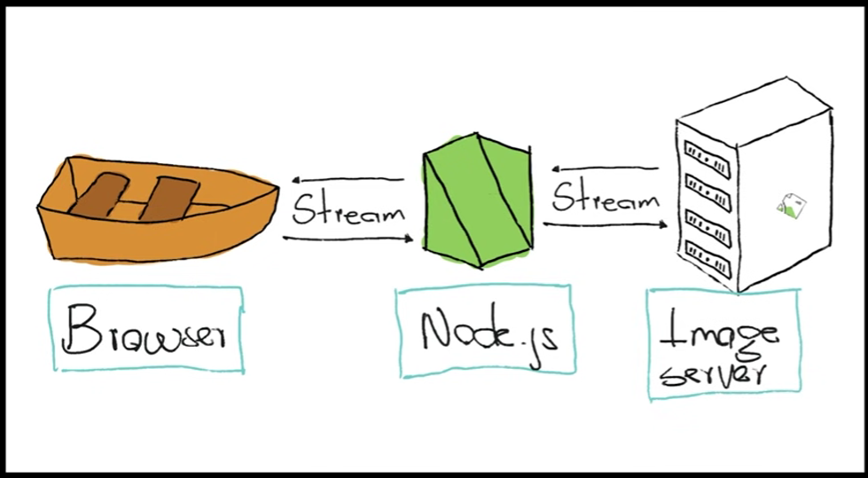
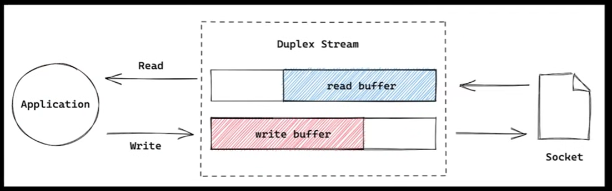
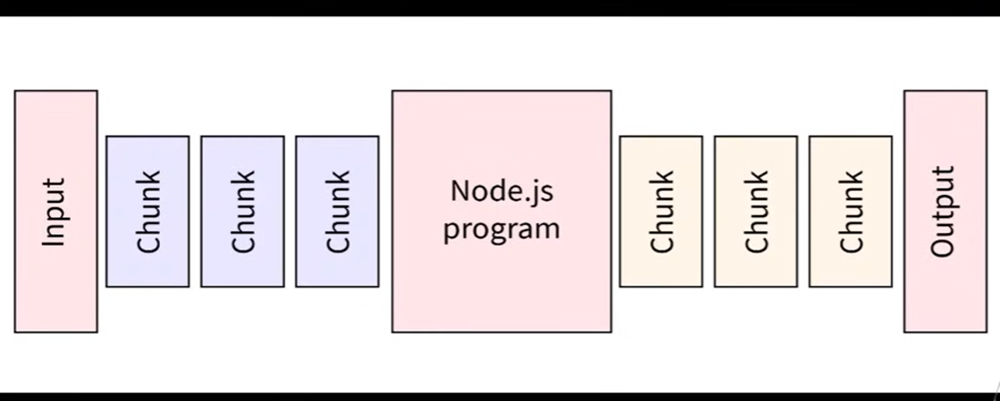
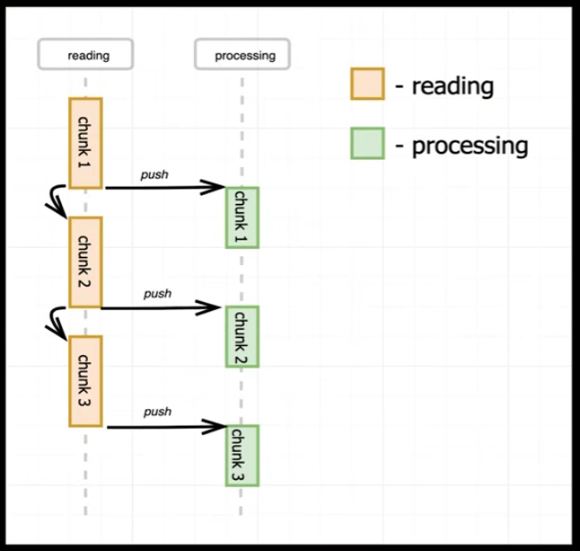
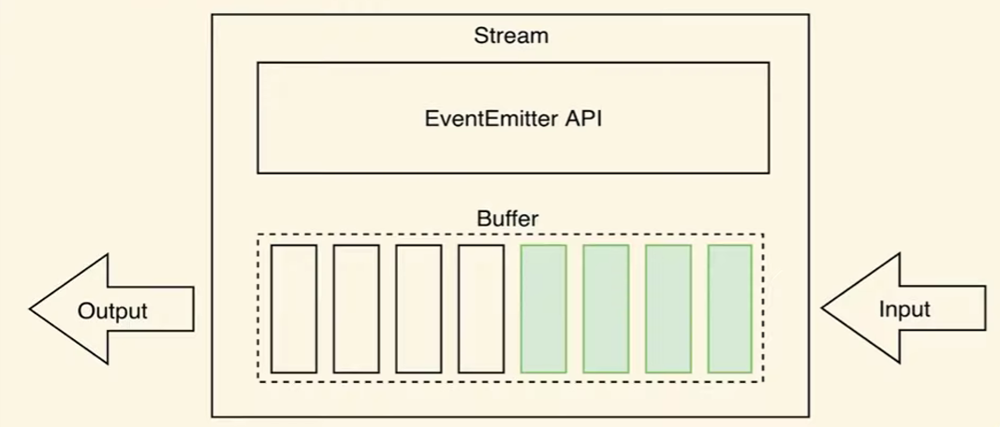

Parsing Request

5.1 Streams


A stream in Node.js is a way to handle data piece by piece (chunks) instead of loading the entire data into memory at once.

Streams are useful when working with:

* Large files
* HTTP requests and responses
* Video/audio streaming
* Real-time data transfer

Instead of waiting for all data to arrive, streams process data continuously.

In Node.js HTTP module:

* req (request) is a Readable Stream
* res (response) is a Writable Stream

This means:

* Client sends data in chunks
* Server sends response in chunks



Sockets

In Node.js, sockets are used for network communication between a client and a server. When a connection is created, Node.js opens a socket that continuously sends and receives data. Sockets in Node.js are event-driven and work asynchronously, making them efficient for real-time applications.
Eg., 127.0.0.1 : 3000
Here:

* 127.0.0.1 (localhost) → IP address
* 3000 → Port
* TCP → protocol used by Node.js HTTP server

Together, they form a network socket endpoint.

Node.js creates a socket and binds it to port 3000.
Now the server waits for incoming client connections on that socket

Duplex Streams 

Duplex streams in Node.js work by allowing both reading and writing operations on the same stream object. For example, a socket can receive incoming data while also sending responses at the same time. This enables two-way communication without blocking execution.

Buffers 

Buffers in Node.js work as temporary storage areas for binary data. When streams transfer data, Node.js stores incoming chunks inside buffers before processing them. This allows large files or network data to be handled efficiently without loading everything into memory at once.

5.2 Chunks



A chunk is a small piece of data transferred by a stream. Instead of sending or receiving the entire data at once, Node.js breaks it into smaller parts called chunks. This makes data transfer faster and memory efficient, especially for large files or network communication.

For example, when reading a large file or receiving an HTTP request, data may arrive in multiple chunks. Streams process each chunk one by one until all data is completed.



In Node.js, streams read data from the operating system in small pieces called chunks. These chunks are temporarily stored in buffers. Whenever a chunk becomes available, Node.js emits a data event and passes that chunk to the program for processing.

Example:
```javascript
stream.on("data", (chunk) => {
    console.log(chunk.toString());
});
```

Here, Node.js does not wait for the entire file or request to finish. It continuously receives chunks, processes them one by one, and finally emits an end event when all data has been read. This non-blocking approach makes Node.js efficient for handling large amounts of data.

5.3 Buffers

In streams, buffers are temporary memory areas used to store chunks of data while they are being transferred. When Node.js reads data from a file, network, or request, the chunks are first placed into a buffer before being processed. This allows streams to handle large data efficiently without loading everything into memory at once.



Streams in Node.js are built on top of the EventEmitter API. When data enters the buffer, the stream emits events like data, end, or error. The data event sends buffered chunks to the program for processing.

So technically:

* Buffer stores temporary binary data
* EventEmitter notifies when data is ready
* Streams use both together to process chunks asynchronously

5.4 Reading Chunks

```javascript
else if (req.url.toLowerCase() === "/submit-details" 
    && req.method == "POST"){
        req.on('data', (chunk) => {
            console.log(chunk);
            console.log(chunk.toString());
            console.log(typeof chunk);
        });
        
        fs.writeFileSync('user.txt', "Female");
        res.statusCode = 302;
        res.setHeader('Location', '/');
        return res.end();
    }
```
``` bash
<Buffer 6e 61 6d 65 3d 53 69 6d 72 61 6e 2b 44 61 6c 76 69 26 67 65 6e 64 65 72 3d 66 65 6d 61 6c 65>
name=Simran+Dalvi&gender=female
object
```
* chunk is a Buffer object
* chunk.toString() converts buffer bytes into readable text
* typeof chunk gives "object" because Buffer is an object in Node.js
* The hexadecimal values inside the Buffer are raw bytes representing the form data.

5.5 Buffering Chunks

The chunks that we got are all hexadesimal value. Not readable by humans. o lets park these chunks in buffer and then convert /  parse them into human radable form.

```javascript
    else if( req.url === "/submit-details" && req.method == "POST"){
        const body = []; // array to store the chunks
        req.on('data', chunks =>{
            console.log(chunks);
            body.push(chunks);
        });

        req.on('end', ()=>{
            const inpt = Buffer.concat(body).toString();
            console.log(inpt);
        });

        fs.writeFileSync('user.txt', 'Jasmine');
        res.statusCode = 302;
        res.setHeader('Location', "/");
        return res.end();

    }
```

5.6 Parsing Request
```javascript
else if(req.url ==="/submit-details" && req.method == "POST"){
        const body =[];
        req.on('data', (chunks) =>{
            body.push(chunks);
        });
        req.on('end', () => {
            const inpt = Buffer.concat(body).toString();
            const params = new URLSearchParams(inpt);
            const bodyObject = {};
            for (const [key, val] of params.entries()){
                bodyObject[key] = val;
            }
            console.log(bodyObject);
        });
        res.statusCode = 302;
        res.setHeader('Location', '/');
        return res.end();
    }
```

or just use the object class:

```javascript
else if(req.url ==="/submit-details" && req.method == "POST"){
        const body =[];
        req.on('data', (chunks) =>{
            body.push(chunks);
        });
        req.on('end', () => {
            const inpt = Buffer.concat(body).toString();
            const params = new URLSearchParams(inpt);
            const bodyObject = Object.fromEntries(params);
            console.log(bodyObject);
        });
        res.statusCode = 302;
        res.setHeader('Location', '/');
        return res.end();
    }
```

noow sychronously write this in the file "user.txt":
```javascript
req.on('end', () => {
            const inpt = Buffer.concat(body).toString();
            const params = new URLSearchParams(inpt);
            const bodyObject = Object.fromEntries(params);
            console.log(bodyObject);
            fs.writeFileSync('user.txt', JSON.stringify(bodyObject));
        });
```

5.7 Using Modules
app.js handles the server connection and handler.js is the requestHandler function defining the APIs in this server.

`module.exports` exports the required methods for the js files to use. And these files are imported using `require()` method.

```javascript
// multiple exports using object
module.exports = {
    handler : requestHandler,
    extra : "Extra"
}

// Setting multiple properties
module.exports.handler = requestHandler;
module.exports.extra = "Extra";

// Shortcut
exports.handler = requestHandler;
exports.extra = "Extra";
```