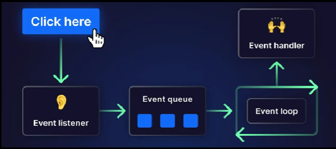
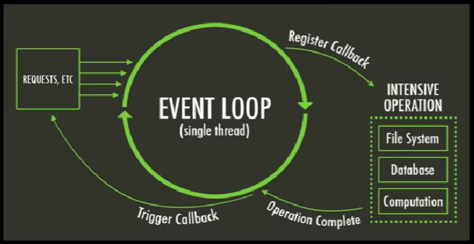
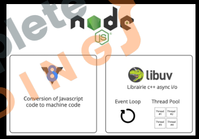
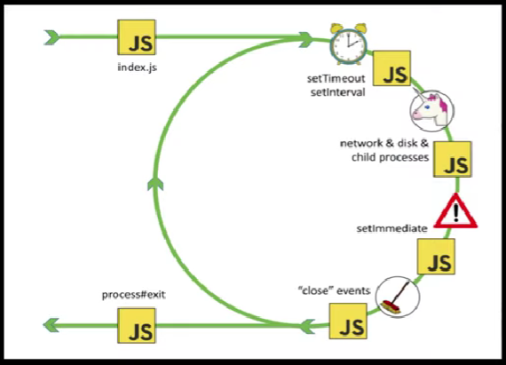
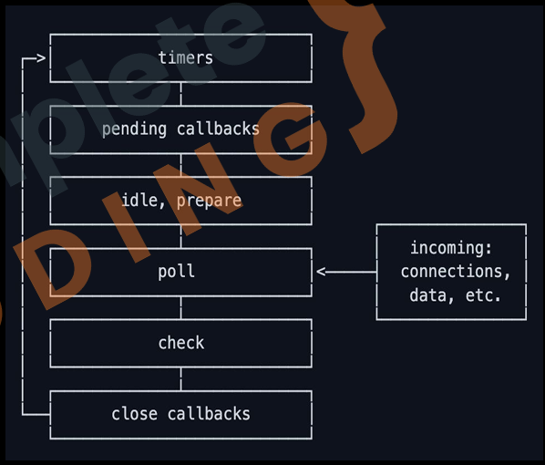

Event Loop

6.1 Event Driven


Node.js works on an event-driven architecture.
Whenever a client makes a request or performs an action, an event listener listens for that event and places it inside the event queue.

The event loop continuously checks this queue. If it finds an event waiting, it sends that event to the appropriate event handler. The event handler then performs the required task, such as reading a file, handling a request, or sending a response.

This process allows Node.js to handle multiple requests efficiently without blocking the execution of other tasks.

6.2 Single Threaded



JavaScript and the Node.js runtime are single-threaded, meaning they execute code on a single main thread. Because of this, incoming requests and tasks are managed through queues instead of creating a new thread for every request.

For time-consuming operations like file handling, database queries, or network requests, Node.js registers a callback function and offloads the task to worker threads provided by the system or libuv. This allows the main thread to continue handling other requests without getting blocked.

Once the worker thread finishes its task, it sends an operation complete callback back to the event queue. The event loop then picks up this callback and executes it, allowing the response to be sent back to the client asynchronously.

6.3 V8 vs libuv

V8

1. Open-source javaScript engine by Google.
2. Used in Chrome and Node.js
3. Compiles Javascript to native machine code.
4. Ensures high-performance JavaScript execution.

libuv

1. Multi-platform support library for Node.js.
2. Handles asynchronous I/O operations.
3. Provides event-driven architecture.
4. Manages file-system, networking, and timers non-blocking across platforms.



6.4 Node Runtime

Let's see how node works at runtime:

```javascript
console.log("Starting Node.js");

db.query("SELECT * FROM public.cars", function(err, res){
    console.log("Query Executed");
});

Console.log("Before query result");
```
1. An invoked function is added to the call stack. Once it returns a value, it is popped off.

```bash
OUTPUT>> Starting Node.js
```
2. Database queries or other I/O ops do not block Node.js single thread because Libuv API handles them.
3. While Libuv asynchronously handles I/O operations, Node.js single thread keeps running code.
```bash
OUTPUT>> Starting Node.js
    Before query result
```
4. Callbacks of completed queries are moved to the event queue. If the call stack is empty, the event loop checks for callbacks and transfers the first.

```bash
OUTPUT>> Starting Node.js
    Before query result
    Query executed
```

6.5 Event Loop



priority wise timers are given the highest priority, then pending callbacks, then idle and so on...

* timers : this phase executes callbacks scheduled by setTimeou() and setInterval().
* pending callbacks: executed I/O callbacks deferred to the next loop iteration.
* idle, prepare: only used internally.
* poll: retrieve new I/O events; execute I/O related callbacks (almost all with exception of close callbacks, the ones scheduled by timers, and setImmediate()); node will block here when appropriate.
* check: setImmediate() callbacks are invoked here.
* close callbacks: some close callbacks, e.g. socket.on('close',...).



6.6 Async Code
```javascript
const sumRequestHandler = (req, res) =>{
    console.log("1. In the Sum Request Handler");
    const body = [];
    let result;
    req.on('data', (chunks) =>{body.push(chunks);
        console.log("2. Chunking done");
    });
    req.on('end', ()=>{
        const inpt = Buffer.concat(body).toString();
        const param = new URLSearchParams(inpt);
        const objt = Object.fromEntries(param);
        result = Number(objt.First) + Number(objt.Second);
        console.log("result");
        console.log("3. Found the result"); 
    });
    console.log("4. Result as response");
    res.setHeader('Location', '/');
        res.statusCode = 302;
        res.write(`
             <html>
            <head><title>Practise Set</title></head>
            <body>
                <h1>Your Sum is ${result}</h1>
            </body>  
            <html>  
            `)
        return res.end();
};
```
```bash
Simran@Jasmine MINGW64 /d/Project/practice_Node.js/Chapter_6/calculator (main)
$ node app.js 
Server is listening at http://localhost:3000
/calculator GET
/favicon.ico GET
/.well-known/appspecific/com.chrome.devtools.json GET
/calculator-result POST
1. In the Sum Request Handler
4. Result as response
2. Chunking done
result
3. Found the result
/ GET
/favicon.ico GET
/.well-known/appspecific/com.chrome.devtools.json GET
```


6.7 Blocking Code
